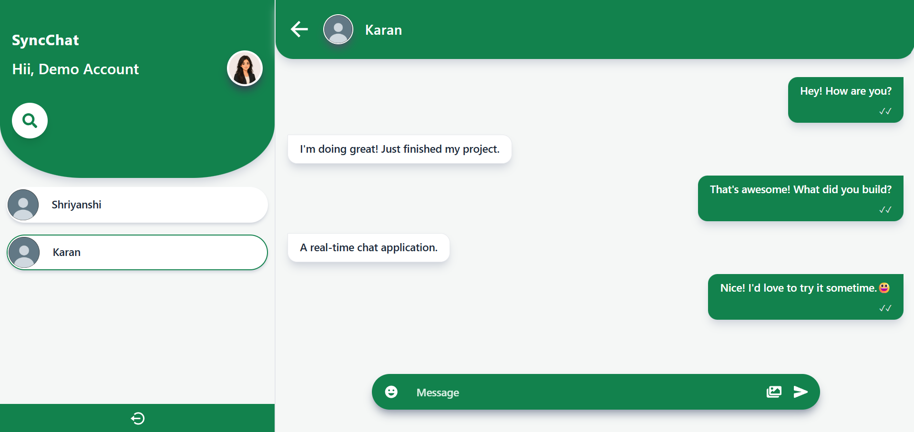
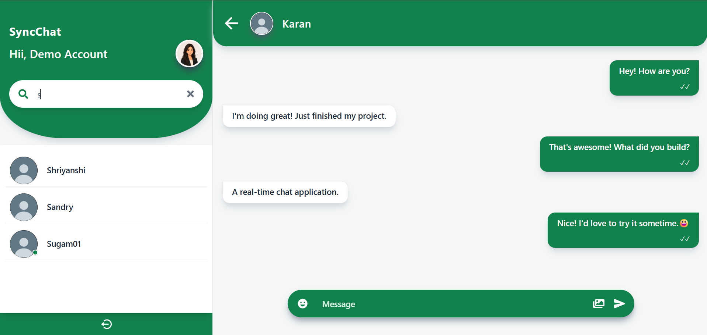
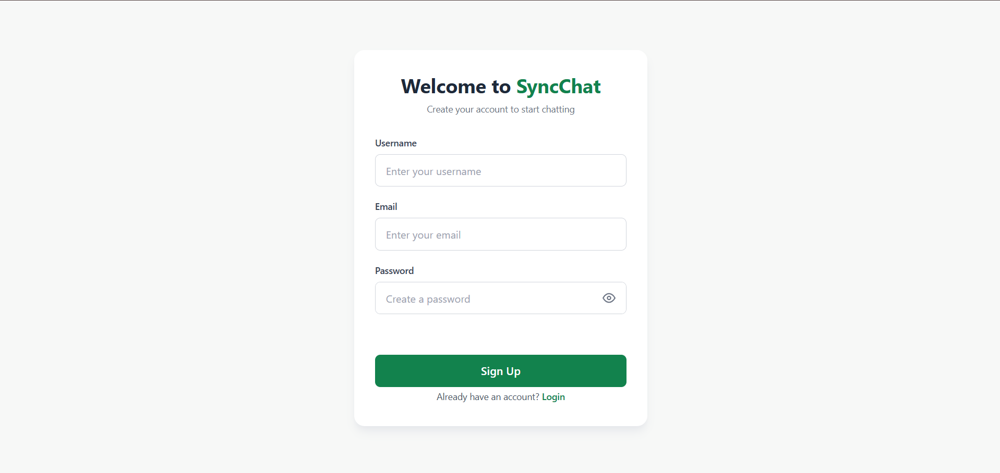
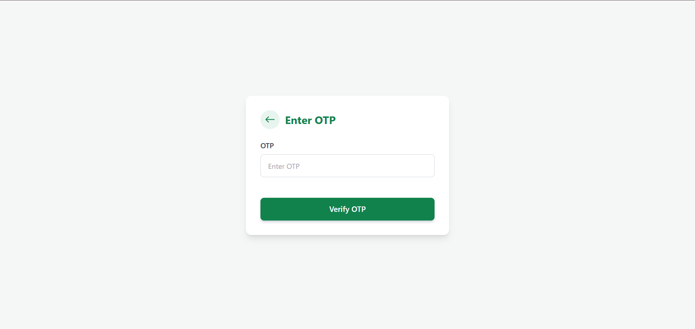
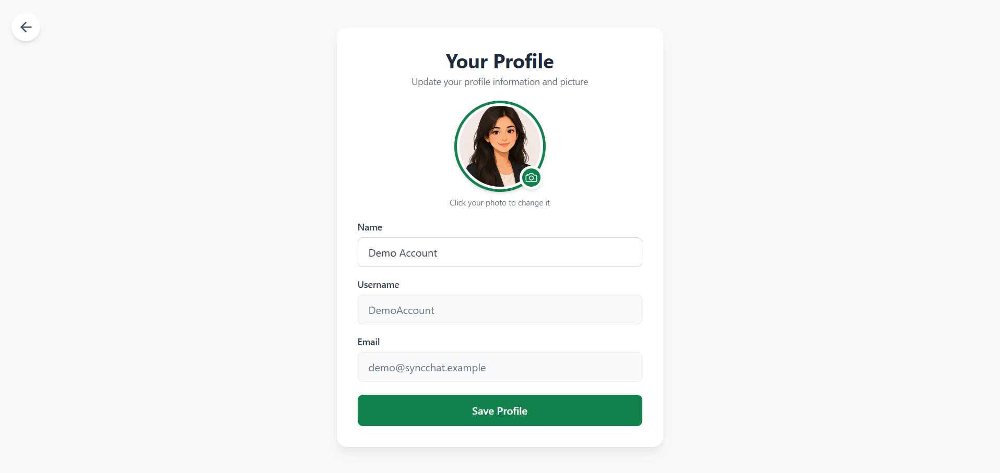

# SyncChat | Connect Instantly
SyncChat is a real-time 1-to-1 chat application built with the MERN stack and Socket.IO, featuring JWT-based authentication, OTP email verification, live messaging, typing indicators, online presence, read receipts, and image sharing.

## 🚀 Live Demo
[🌐 Live Demo](https://syncchat-frontend-vggb.onrender.com/) · [💻 GitHub Repository](https://github.com/SamriddhiMalhotra/SyncChat)

## 📸 Screenshots

### Chat Interface


### User Search


### Sign Up


### OTP Verification


### Profile


## ✨ Features
- 🔐 JWT-based user authentication
- 📧 Email OTP verification
- 💬 1-to-1 real-time messaging
- ⚡ Real-time communication using Socket.IO
- 🟢 Online/offline user presence
- ⌨️ Live typing indicators
- ✓ Read receipts
- 🖼️ Image sharing with Cloudinary
- 🔎 User search
- 💬 Conversation-based sidebar
- 🗃️ Global state management with Redux Toolkit

## 🛠️ Tech Stack
### Frontend
- React.js
- Redux Toolkit
- Tailwind CSS
- Axios
- Socket.IO Client

### Backend
- Node.js
- Express.js
- MongoDB
- Mongoose
- Socket.IO

### Authentication & Services
- JWT
- Resend
- Cloudinary

### Deployment
- Render

## ⚙️ Getting Started

### Prerequisites
- Node.js
- MongoDB

### Installation

1. Clone the repository:
```bash
git clone https://github.com/SamriddhiMalhotra/SyncChat.git
```

2. Install dependencies:
```bash
cd frontend
npm install

cd ../backend
npm install
```
3. Configure the required environment variables.

4. Start the backend:
```bash
npm run dev
```
5. Start the frontend:
```bash
npm run dev
```
6. Open the frontend URL in your browser.

## 🔐 Environment Variables
Create a `.env` file in the `backend` directory:
```env
PORT=8000
MONGODB_URL=your_mongodb_connection_string
JWT_SECRET=your_jwt_secret
CLOUD_NAME=your_cloudinary_cloud_name
API_KEY=your_cloudinary_api_key
API_SECRET=your_cloudinary_api_secret
RESEND_API_KEY=your_resend_api_key
```

## 📁 Project Structure

```text
SyncChat/
├── frontend/       # React frontend
├── backend/        # Node.js + Express backend
├── README.md
└── ...
```

## 👨‍💻 Author
Built by **Samriddhi Malhotra**

- GitHub: [SamriddhiMalhotra](https://github.com/SamriddhiMalhotra)
- LinkedIn: [Samriddhi Malhotra](https://www.linkedin.com/in/samriddhi-malhotra01/)
